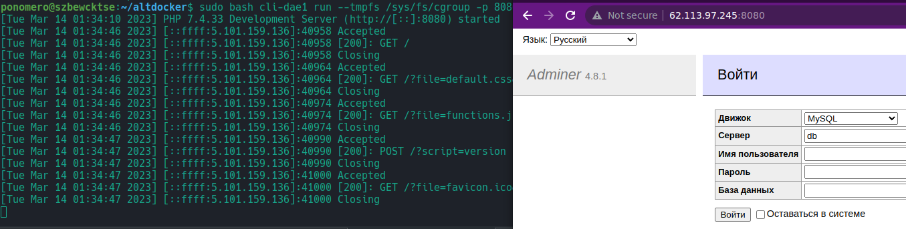
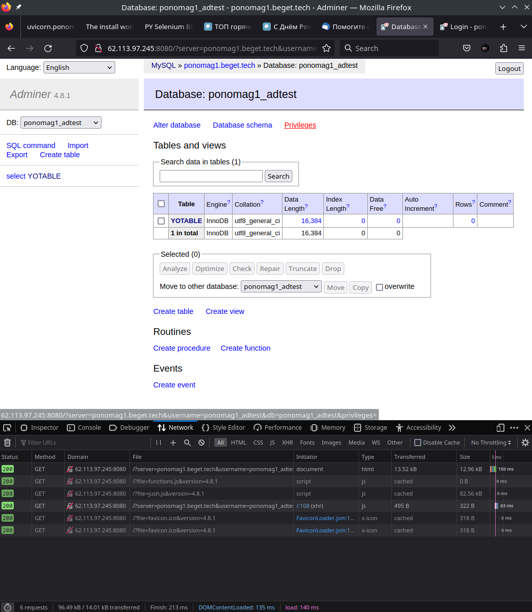

---

# T5: DOCKER DAEMON
## Задача 5

Поднять второй докер-демон https://github.com/mlosev/altdocker.
Запустить на нём контейнер с adminer-ом. Сделать так, чтобы можно было открыть web-интерфейс adminer-а введя http://localhost:8080 в браузере.
Подключиться из него к базе на хостинге (предварительно создав её на тестовом аккаунте).

---

### ARCH LINUX WAY
```
$ sh get_docker.sh
+ DOCKER_VERSION=1.12.1
+ '[' '!' -s docker-1.12.1.tgz ']'
+ curl -o docker-1.12.1.tgz https://get.docker.com/builds/Linux/x86_64/docker-1.12.1.tgz
  % Total    % Received % Xferd  Average Speed   Time    Time     Time  Current
                                 Dload  Upload   Total   Spent    Left  Speed
100 27.5M  100 27.5M    0     0  5243k      0  0:00:05  0:00:05 --:--:-- 6409k
+ tar -xzvf docker-1.12.1.tgz
docker/
docker/docker-containerd-ctr
docker/docker
docker/docker-containerd
docker/dockerd
docker/docker-proxy
docker/docker-runc
docker/docker-containerd-shim

$ rm ci-dae1 cli-dae1 dae1

$ realpath altdocker.sh 
/home/alex/Documents/CODE/BG_AdminTest/T5/altdocker/altdocker.sh

$ realpath altdockerd.sh
/home/alex/Documents/CODE/BG_AdminTest/T5/altdocker/altdockerd.sh

$ ln -s /home/alex/Documents/CODE/BG_AdminTest/T5/altdocker/altdocker.sh cli-dae1

$ ln -s /home/alex/Documents/CODE/BG_AdminTest/T5/altdocker/altdockerd.sh dae1

sudo sh dae1
INFO[0000] libcontainerd: new containerd process, pid: 16304 
WARN[0000] containerd: low RLIMIT_NOFILE changing to max  current=1024 max=524288
FATA[0000] can't create unix socket /home/alex/Documents/CODE/BG_AdminTest/T5/altdocker/altdocker/dae1/exec/libcontainerd/docker-containerd.sock: listen unix /home/alex/Documents/CODE/BG_AdminTest/T5/altdocker/altdocker/dae1/exec/libcontainerd/docker-containerd.sock: bind: invalid argument 
INFO[0006] libcontainerd: new containerd process, pid: 16336 
WARN[0000] containerd: low RLIMIT_NOFILE changing to max  current=1024 max=524288
FATA[0000] can't create unix socket /home/alex/Documents/CODE/BG_AdminTest/T5/altdocker/altdocker/dae1/exec/libcontainerd/docker-containerd.sock: listen unix /home/alex/Documents/CODE/BG_AdminTest/T5/altdocker/altdocker/dae1/exec/libcontainerd/docker-containerd.sock: bind: invalid argument
```
Всё плохо.

### UBUNTU SERVER WAY
**tty1** - запуск докер демона
```
ponomero@szbewcktse:~/altdocker$ sudo apt install bridge-utils

ponomero@szbewcktse:~/altdocker$ sudo apt-get install -y cgroupfs-mount 

ponomero@szbewcktse:~/altdocker$ sudo apt-get -y install cgroup-tools

ponomero@szbewcktse:~/altdocker$ sudo service docker stop
Warning: Stopping docker.service, but it can still be activated by:
  docker.socket

ponomero@szbewcktse:~/altdocker$ sudo systemctl stop docker.socket

ponomero@szbewcktse:~/altdocker$ sudo service containerd stop

ponomero@szbewcktse:~/altdocker$ sudo cgroupfs-umount
rmdir: failed to remove 'init.scope': Device or resource busy
rmdir: failed to remove 'system.slice': Device or resource busy
rmdir: failed to remove 'user.slice': Device or resource busy

ponomero@szbewcktse:~/altdocker$ sudo cgroupfs-mount
mount: /sys/fs/cgroup/cpuset: cgroup already mounted or mount point busy.
mount: /sys/fs/cgroup/cpu: cgroup already mounted or mount point busy.
mount: /sys/fs/cgroup/blkio: cgroup already mounted on /sys/fs/cgroup/cpuacct.
mount: /sys/fs/cgroup/memory: cgroup already mounted on /sys/fs/cgroup/cpuacct.
mount: /sys/fs/cgroup/pids: cgroup already mounted on /sys/fs/cgroup/cpuacct.

ponomero@szbewcktse:~/altdocker$ sudo bash dae1
INFO[0000] libcontainerd: new containerd process, pid: 1952 
WARN[0000] containerd: low RLIMIT_NOFILE changing to max  current=1024 max=1048576
INFO[0001] Graph migration to content-addressability took 0.00 seconds 
WARN[0001] Your kernel does not support cgroup memory limit 
WARN[0001] Unable to find cpu cgroup in mounts          
WARN[0001] Unable to find blkio cgroup in mounts        
WARN[0001] Unable to find cpuset cgroup in mounts       
WARN[0001] mountpoint for pids not found                
INFO[0001] Loading containers: start.                   
INFO[0001] Firewalld running: false                     

INFO[0001] Loading containers: done.                    
INFO[0001] Daemon has completed initialization          
INFO[0001] Docker daemon                                 commit=23cf638 graphdriver=overlay2 version=1.12.1
INFO[0001] API listen on /home/ponomero/altdocker/altdocker/dae1/docker.sock 
```
Демон успешно запушен и реагирует на наши дейтсвия.

**tty2** - запуск докер клиента (adminer на порт 8080)
```
ponomero@szbewcktse:~/altdocker$ sudo bash cli-dae1 version
Client:
 Version:      1.12.1
 API version:  1.24
 Go version:   go1.6.3
 Git commit:   23cf638
 Built:        Thu Aug 18 17:52:38 2016
 OS/Arch:      linux/amd64

Server:
 Version:      1.12.1
 API version:  1.24
 Go version:   go1.6.3
 Git commit:   23cf638
 Built:        Thu Aug 18 17:52:38 2016
 OS/Arch:      linux/amd64

$ sudo bash cli-dae1 run -p 8080:8080 adminer
docker: Error response from daemon: oci runtime error: rootfs_linux.go:53: mounting "/sys/fs/cgroup" to rootfs "/home/ponomero/altdocker/altdocker/dae1/graph/overlay2/ad5ec5455abb5fed489310c814929e1664d49ed9b9b8e792217320a3d048b573/merged" caused "no subsystem for mount".

ponomero@szbewcktse:~/altdocker$ sudo bash cli-dae1 images
REPOSITORY          TAG                 IMAGE ID            CREATED             SIZE
adminer             latest              dcabc6cf54dd        19 hours ago        250.1 MB

ponomero@szbewcktse:~/altdocker$ sudo bash cli-dae1 ps -a
CONTAINER ID        IMAGE               COMMAND                  CREATED              STATUS              PORTS               NAMES
10c9bfb3e790        adminer             "entrypoint.sh php -S"   About a minute ago   Created                                 focused_wing


```
Чтож... Пока что клиент не может запустить контейнер. 

**UPD 2023-03-14**

Команда `info` выполняется:
```
ponomero@szbewcktse:~/altdocker$ sudo bash cli-dae1 info
Containers: 14
 Running: 0
 Paused: 0
 Stopped: 14
Images: 2
Server Version: 1.12.1
Storage Driver: overlay2
 Backing Filesystem: extfs
Logging Driver: json-file
Cgroup Driver: cgroupfs
Plugins:
 Volume: local
 Network: host overlay null bridge
Swarm: inactive
Runtimes: runc
Default Runtime: runc
Security Options: apparmor seccomp
Kernel Version: 5.15.0-67-generic
Operating System: Ubuntu 22.04.2 LTS
OSType: linux
Architecture: x86_64
CPUs: 2
Total Memory: 1.929 GiB
Name: szbewcktse
ID: W735:TWSD:OLTY:5EHJ:B2QW:UQ2I:6SRK:BM6G:MHIP:WMFY:G3PW:4BPX
Docker Root Dir: /home/ponomero/altdocker/altdocker/dae1/graph
Debug Mode (client): false
Debug Mode (server): false
Registry: https://index.docker.io/v1/
WARNING: No memory limit support
WARNING: No swap limit support
WARNING: No kernel memory limit support
WARNING: No oom kill disable support
WARNING: No cpu cfs quota support
WARNING: No cpu cfs period support
WARNING: No cpu shares support
WARNING: No cpuset support
Insecure Registries:
 127.0.0.0/8
```

Рабочая команда `bash cli-dae1 run --tmpfs /sys/fs/cgroup -p 8080:8080 adminer`.
```
ponomero@szbewcktse:~/altdocker$ sudo bash cli-dae1 run --tmpfs /sys/fs/cgroup -p 8080:8080 adminer
[Tue Mar 14 01:34:10 2023] PHP 7.4.33 Development Server (http://[::]:8080) started
[Tue Mar 14 01:34:46 2023] [::ffff:5.101.159.136]:40958 Accepted
[Tue Mar 14 01:34:46 2023] [::ffff:5.101.159.136]:40958 [200]: GET /
[Tue Mar 14 01:34:46 2023] [::ffff:5.101.159.136]:40958 Closing
[Tue Mar 14 01:34:46 2023] [::ffff:5.101.159.136]:40964 Accepted
[Tue Mar 14 01:34:46 2023] [::ffff:5.101.159.136]:40964 [200]: GET /?file=default.css&version=4.8.1
[Tue Mar 14 01:34:46 2023] [::ffff:5.101.159.136]:40964 Closing
[Tue Mar 14 01:34:46 2023] [::ffff:5.101.159.136]:40974 Accepted
[Tue Mar 14 01:34:46 2023] [::ffff:5.101.159.136]:40974 [200]: GET /?file=functions.js&version=4.8.1
[Tue Mar 14 01:34:46 2023] [::ffff:5.101.159.136]:40974 Closing
[Tue Mar 14 01:34:47 2023] [::ffff:5.101.159.136]:40990 Accepted
[Tue Mar 14 01:34:47 2023] [::ffff:5.101.159.136]:40990 [200]: POST /?script=version
[Tue Mar 14 01:34:47 2023] [::ffff:5.101.159.136]:40990 Closing
[Tue Mar 14 01:34:47 2023] [::ffff:5.101.159.136]:41000 Accepted
[Tue Mar 14 01:34:47 2023] [::ffff:5.101.159.136]:41000 [200]: GET /?file=favicon.ico&version=4.8.1
[Tue Mar 14 01:34:47 2023] [::ffff:5.101.159.136]:41000 Closing

```
В данном случае приложение `adminer` запустилось.



Проблему запуска контейнера решена использованием ключа: `--tmpfs /sys/fs/cgroup`. 

Более подробно про монтирование здесь: https://docs.docker.com/storage/tmpfs/

Спасибо [golern256](https://github.com/golern256)!

**END UPD**


Моё альтернативное решение смотри ниже.
### Commands

`sudo bash dae1` - daemon

`sudo bash cli-dae1` - cli, напиример `run -p 8080:8080 adminer`

### CGROUP

```
ponomero@szbewcktse:~/altdocker$ mount | grep cgroup
cgroup2 on /sys/fs/cgroup type cgroup2 (rw,nosuid,nodev,noexec,relatime,nsdelegate,memory_recursiveprot)
cgroup on /sys/fs/cgroup/cpuacct type cgroup (rw,relatime,cpuacct)
cgroup on /sys/fs/cgroup/devices type cgroup (rw,relatime,devices)
cgroup on /sys/fs/cgroup/freezer type cgroup (rw,relatime,freezer)
cgroup on /sys/fs/cgroup/net_cls type cgroup (rw,relatime,net_cls)
cgroup on /sys/fs/cgroup/perf_event type cgroup (rw,relatime,perf_event)
cgroup on /sys/fs/cgroup/net_prio type cgroup (rw,relatime,net_prio)
cgroup on /sys/fs/cgroup/hugetlb type cgroup (rw,relatime,hugetlb)
cgroup on /sys/fs/cgroup/rdma type cgroup (rw,relatime,rdma)
cgroup on /sys/fs/cgroup/misc type cgroup (rw,relatime,misc)
```

### Some more
```
sudo service docker stop
sudo service containerd stop
sudo cgroupfs-umount
sudo cgroupfs-mount
sudo service containerd start
sudo service docker start

sudo systemctl stop docker.socket
sudo systemctl stop containerd

mount -t cgroup cgroup /sys/fs/cgroup
```

VPS `ponomero@szbewcktse` IP: 62.113.97.245

```
cat /proc/cgroups | column -t
```

### Рабочее fast решение

Сделать так, чтобы можно было открыть web-интерфейс adminer-а введя http://localhost:8080 в браузере.
Подключиться из него к базе на хостинге (предварительно создав её на тестовом аккаунте).

1. Устанавливаем docker по официальной инсрукции.
2. Запускаем контейнер с adminer на порт 8080:
```
docker run -p 8080:8080 adminer
```

DB connection: (убери 555)
```
ponomag1_adtest

%3kjgUgK555

ponomag1.beget.tech
```

Заходим http://62.113.97.245:8080 и видим:



### Вывод

Из информации в интрнете и моих действий, могу предположить, что проблема в версии docker в репозитории из задания - `1.12.1`. На новых версиях docker контейнер adminer'а создаётся и работает легко, как на UBUNTU SERVER, так и на ARCH LINUX.

Похоже, что старый docker, cgroups и новые дистры linux не дружат между собой. Скорее всего проблему можно решить через cgroupfs настроив монтирвание.

Также проблему можно решить создав altdocker из бинарников более новыйх версий docker.

Либо установив docker в ОС, создовать контейнеры напрямую docker'ом, без altdocker.